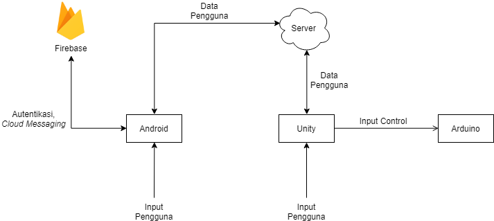
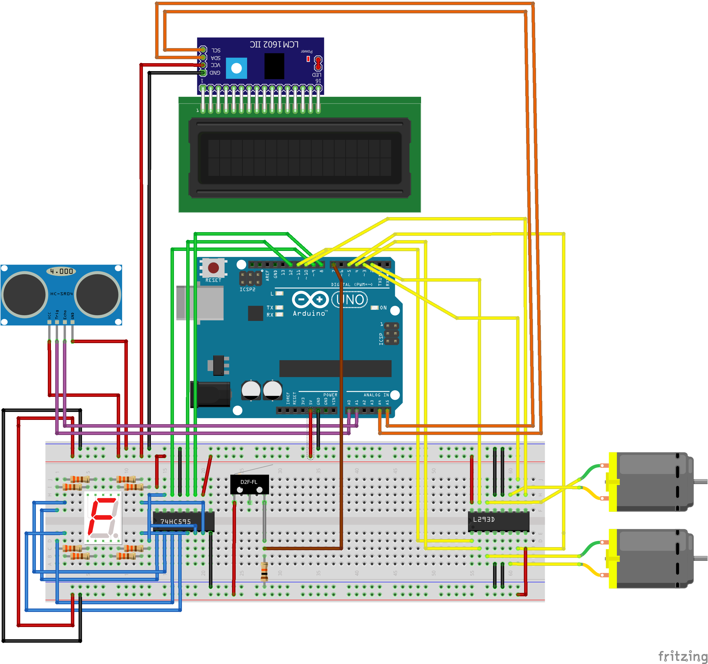
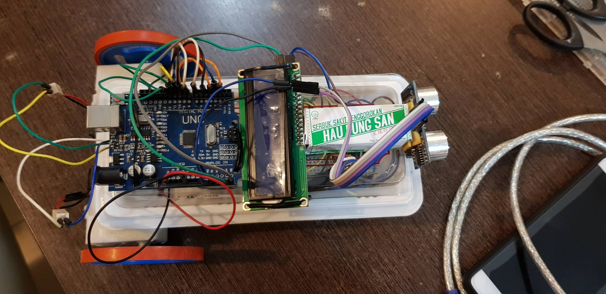
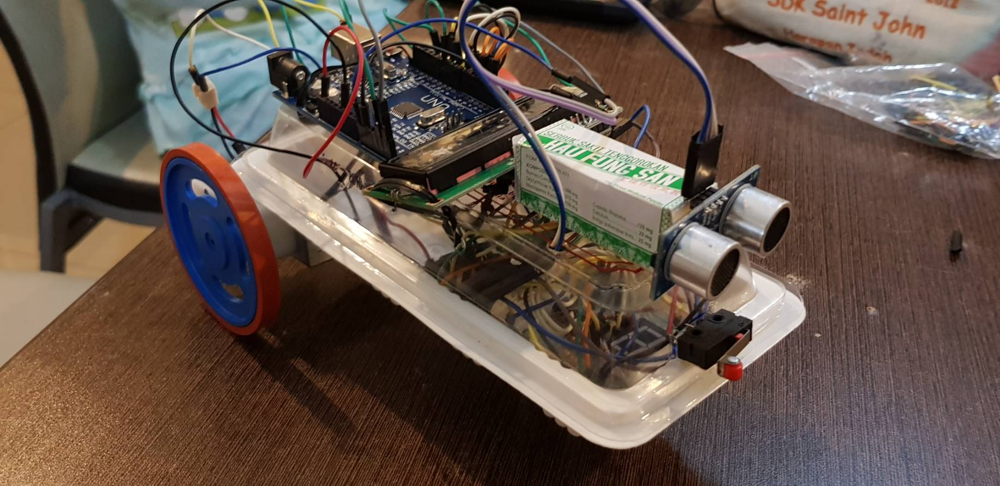

# SIM Simulator 

Oleh :

13515035 - Oktavianus Handika

13515065 - Felix Limanta

13515077 - Rionaldi Chandraseta

## Deskripsi Sistem

SIM Simulator merupakan alat simulasi untuk membantu masyarakat yang ingin mengikuti ujian pengambilan SIM (Surat Izin Mengemudi) kategori A (SIM A), baik dalam ujian teori maupun ujian praktik. Sistem ini merupakan gabungan dari tiga subsistem yang dibangun dengan tiga platform berbeda, yaitu Android, Unity, dan Arduino.

#### Diagram Sistem Keseluruhan

### Subsistem Android

Dalam subsistem Android, sistem dapat menentukan kemampuan teori *user* dalam berlalu lintas. Nilai yang didapat oleh *user* dalam simulasi ujian teori akan dimasukkan ke dalam *cloud server* agar dapat diakses oleh subsistem lainnya. Selain itu, sistem juga dapat menentukan apakah *user* dinyatakan layak mendapatkan SIM A berdasarkan gabungan nilai ujian teori dan nilai ujian praktik yang dilakukan dengan Unity.

#### Tujuan dan Fungsi

Tujuan dari subsistem Android pada SIM Simulator adalah menyimulasikan ujian teori dalam proses pembuatan SIM A. Aplikasi Android akan menyajikan sejumlah pertanyaan kepada *user*. Aplikasi kemudian akan menentukan apakah *user* lulus ujian teori atau tidak berdasarkan nilai yang diperolehnya.

#### Fitur

- __Ujian dalam bentuk pilihan ganda:__ Simulasi ujian teori pada aplikasi dibuat dalam bentuk soal pilihan ganda dengan jumlah soal yang dapat diatur oleh *user*.
- __*Login* dan *register*:__ Aplikasi menyediakan *register* akun untuk *user* agar profilnya tercatat dalam *database server* aplikasi.
- __*Easter Egg:*__ Logo aplikasi berubah sudut and perubahan warna latar sebagai *easter egg* aplikasi menggunakan *accelerometer sensor*. Logo aplikasi berubah sudut ketika *user* menekan text "SIM SIMULATOR" sebanyak 5 kali. Warna latar aplikasi berubah ketika ketika *user* meng-*hold* logo pada main menu.
- __Deteksi lokasi *user*__: Mendeteksi lokasi *user* dan mencari kantor polisi terdekat dengan sensor GPS

### Subsistem Unity

Dalam subsistem Unity, sistem dapat menyimulasikan ujian praktik untuk pengambilan SIM A. Ketika *user* ingin melakukan ujian praktik, sistem akan memeriksa terlebih dahulu apakah nilai ujian teori *user* mencukupi. Hanya *user* yang lulus ujian teori yang dapat mengambil ujian praktik dalam Unity. Kemajuan user akan dicatat dan dimasukkan ke dalam *cloud server*.

#### Tujuan dan Fungsi

Tujuan dari subsistem Unity pada SIM Simulator adalah menyimulasikan ujian praktik dalam proses pembuatan SIM A. *User* dapat mengemudikan sebuah mobil pada aplikasi kami. Selain itu, tersedia beberapa level berbeda di mana *user* harus berhasil mengendalikan mobil melalui berbagai rintangan. Rintangan-rintangan ini disesuaikan dengan rintangan pada ujian mengemudi sesungguhnya.

#### Fitur

- __Autentikasi *user*:__ apakah *user* telah lulus ujian teori atau belum.
- **Simulasi mobil:** menyimulasikan mobil dengan pergerakan fisik mobil, suara mesin, rotasi setir, dan spion.
- **Rintangan ujian:** setiap rintangan yang dibuat dalam simulasi ini relevan dengan ujian praktik SIM A.
- **Deteksi *goal* dan *failure*:** mendeteksi kondisi *goal* dan *failure* pada setiap rintangan. *User* harus melewati setiap *checkpoint* yang ada dalam suatu rintangan. Ketika mobil bersentuhan dengan suatu objek, maka *user* dinyatakan gagal menjalani suatu rintangan.

### Subsistem Arduino

Dalam subsistem Arduino, sistem dapat menyimulasikan pergerakan mobil virtual di subsistem Unity pada dunia nyata. Sebuah model mobil yang ditenagai Arduino dapat dikontrol melalui model mobil di Unity untuk simulasi yang lebih nyata, di mana ketika *user* menggerakan mobil virtual di Unity, model mobil Arduino juga akan ikut bergerak mengikuti pergerakan mobil virtual tersebut. 

#### Fitur

- **Bergerak:** Sistem dapat bergerak maju, mundur, dan berbelok sesuai dengan masukan *user*.
- **Deteksi Maju/Mundur Mobil:** Deteksi pergerakan mobil apakah sedang maju, diam, atau mundur. Hasil pergerakan akan ditampilkan di 7-*segment*.
- **Deteksi Jarak:** Deteksi jarak pada model mobil menggunakan sensor ultrasonik. Data dari deteksi jarak ini akan dikirim ke LCD untuk ditampilkan nilainya.
- **Deteksi Tabrakan:** Deteksi apakah bagian depan mobil bertabrakan dengan sesuatu, menggunakan *limit switch*. Mobil akan berhenti total ketika bertabrakan.

#### Konfigurasi Rangkaian

#### Dokumentasi Produk Final

## Video Sistem

Video sistem [SimSimulator](https://www.youtube.com/watch?v=QYkI3tHogXc&t=31s).

## Petunjuk Instalasi

#### Subsistem Android:

Download SIM-Simulator.apk dari folder [release](http://gitlab.informatika.org/IF3111-2017-09/Android/tree/master/release)

Install APK tersebut pada smartphone anda.

#### Subsistem Unity:

Jalankan file SIM-Simulator.exe pada folder `SIM-Simulator/bin`dari [repository Unity](http://gitlab.informatika.org/IF3111-2017-09/Unity).

#### Subsistem Arduino:

Rangkai seluruh komponen seperti pada gambar di atas.

*Compile* dan *upload* program `main.ino` ke Arduino.

## Petunjuk Penggunaan Program

#### Untuk subsistem Android:

Pengguna harus melakukan *login* atau *register* akun terlebih dahulu untuk dapat mengakses aplikasi SIM Simulator. Kemudian, *user* akan dibawa ke halaman utama.

Menu dapat diakses dengan melakukan *swipe* ke kanan pada sisi kiri layar atau menekan logo utama.

**Diperlukan koneksi internet** untuk melakukan ujian teori karena soal diambil dari server SIM Simulator.

#### Untuk subsistem Unity:

- *User* terlebih dahulu melakukan *login* dengan akun yang sudah terdaftar pada Google Firebase dengan catatan ***user* harus lulus simulasi ujian teori terlebih dahulu pada aplikasi Android**.
- *User* akan mulai melakukan simulasi ujian dari *stage* pertama, secara keseluruhan terdapat 5 *stage* permainan. Jika *user* berhasil lulus pada suatu *stage* maka *user* dapat melakukan simulasi pada *stage* berikutnya secara bertahap.
- *User* dinyatakan lulus apabila berhasil mencapai seluruh *checkpoint* yang ada pada suatu permainan tanpa terkena satu *obstacle* pada suatu *stage*. Sehingga, bila *user* terkena satu *obstacle* saja maka dinyatakan gagal.

Konfigurasi tombol yang digunakan pada subsistem Unity:

- **W** / ⬆️ : Maju
- **A** / ⬅️ :  Belok kiri
- **S** / ➡️ :  Belok kanan
- **D** / ⬇️ : Mundur
- **Space** : Rem tangan
- **C** : *Change view*
- Pergerakkan *mouse* digunakan untuk melihat *view* sekeliling *user*.
- **R** : *Restart* permainan (hanya dilakukan ketika *user* gagal dalam suatu *stage*)

#### Untuk subsistem Arduino:

- Jalankan aplikasi Unity
- Masukan port yang digunakan Arduino ke pilihan di menu options
- Tekan 'W', 'A', 'S', 'D' pada keyboard untuk menggerakan sistem Arduino